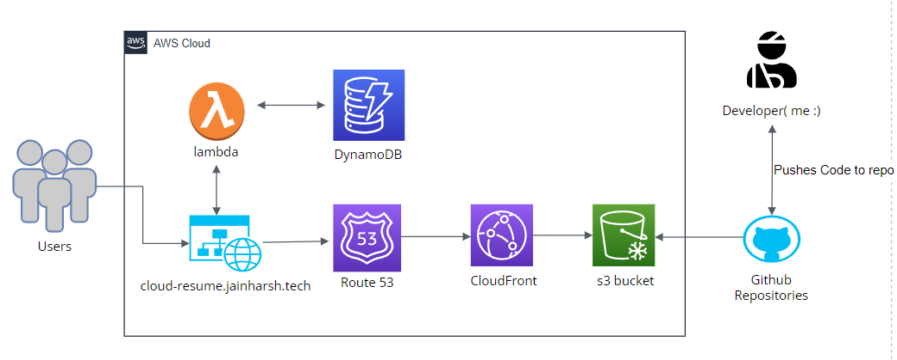

## Architecture Diagram

# AWS Cloud Resume Challenge – Harsh Jain  

Welcome to the repository for **Harsh Jain’s AWS Cloud Resume Challenge**.  
This project is a cloud-native, serverless personal portfolio website that demonstrates expertise in **AWS infrastructure, automation, and modern web development**.  

---

## 🌟 Project Overview  
The **Cloud Resume Challenge** is a practical initiative to build and deploy a resume website utilizing various AWS services and DevOps methodologies.  
The aim is to deliver a **fully serverless, scalable, and automated portfolio experience**, following real-world cloud architecture best practices.  

---

## 🚀 Features  

### Static Website Hosting  
- Hosted on **Amazon S3** as a static site.  

### Global Content Delivery  
- **Amazon CloudFront** acts as a CDN for high availability and HTTPS encryption.  

### Serverless Backend  
- **AWS Lambda** and **API Gateway** power a real-time visitor counter.  

### NoSQL Data Store  
- Visitor counts are managed via **Amazon DynamoDB**.  

### Automated Deployments  
- **GitHub Actions CI/CD pipeline** deploys frontend updates and provisions backend infrastructure.  

### Infrastructure as Code  
- **Terraform** provisions cloud resources and ensures reproducible infrastructure.  

---

## 🛡️ Security and Monitoring  

- **SSL/TLS**: Provided by AWS Certificate Manager with custom domains.  
- **Access Controls**: IAM roles and policies enforce least privilege.  
- **Logging & Monitoring**: AWS CloudWatch monitors Lambda/API Gateway and tracks logs/events.  
- **Optional Extensions**: AWS WAF (Web Application Firewall) and enhanced authorization methods can be added for extra security.  

---

## 🏗️ Architecture  

Refer to the repo’s architecture diagram for a visual overview.  

**Frontend:** Route 53 → CloudFront → S3  
**Backend:** API Gateway → Lambda → DynamoDB  
**DevOps:** GitHub → GitHub Actions → Terraform → AWS  

---

## 📁 Technologies Used  

- **AWS** (S3, CloudFront, Lambda, API Gateway, DynamoDB, Certificate Manager, IAM, CloudWatch, Route 53, WAF)  
- **GitHub & GitHub Actions**  
- **Terraform**  
- **HTML, CSS, JavaScript, Python** (for Lambda)  
- **React** (future/ongoing enhancements)  

---

## 👨‍💻 How It Works  

1. Developer pushes changes to GitHub.  
2. GitHub Actions deploys website files to S3 and triggers Terraform for backend updates.  
3. End users access the website globally via CloudFront.  
4. Serverless visitor counter updates are handled through Lambda/API/DynamoDB.  

---

## 📚 Resources  

- **[Live Website](https://cloud-resume.jainharsh.tech/)**  
- **[Challenge Documentation](https://cloudresumechallenge.dev/docs/the-challenge/aws/)**  
